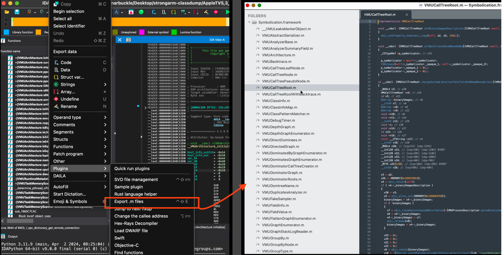

## IDA - export objc as .m files
IDA plugin that exports hexrays pseudocode of objective-c classes into separate `.m` files.

#### Install

Copy `objc_source_export_plugin.py` into IDA's plugins directory.

#### Usage

`Edit -> Plugins -> Export .m files`.

